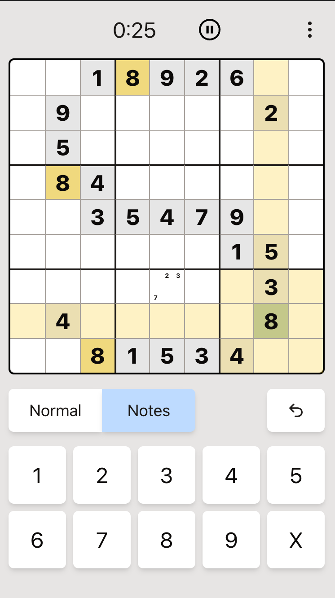

# Sudoku Solver

Web app that imports and solves sudoku puzzles from photos.



## Features

- **Camera/Photo Import** - Capture or upload a photo of a sudoku puzzle
- **Grid Detection** - OpenCV finds and extracts the puzzle grid
- **OCR** - Tesseract recognizes digits in each cell
- **Review & Edit** - Correct any misread digits before solving
- **iPhone Support** - HEIC conversion and EXIF orientation handling

## How It Works

1. Take a photo or select an image file
2. OpenCV detects the grid contours and applies perspective transform
3. Grid is sliced into 81 cells, each run through Tesseract OCR
4. Review recognized digits and edit if needed
5. Confirm to load the puzzle

## Tech Stack

- React + TypeScript + Vite
- TanStack Router
- Redux Toolkit
- OpenCV.js (grid detection)
- Tesseract.js (OCR)
- heic2any + exifr (iPhone photo handling)
- Tailwind CSS

## Development

```bash
npm install
npm run dev
```

## Build

```bash
npm run build
```

## Test

```bash
npm test
```
